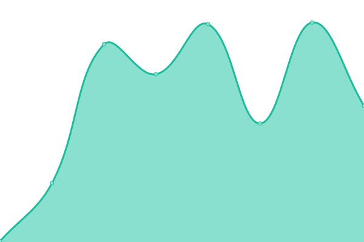
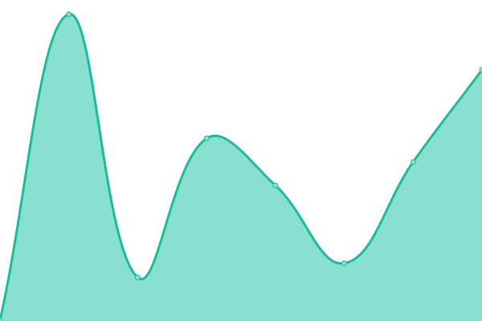
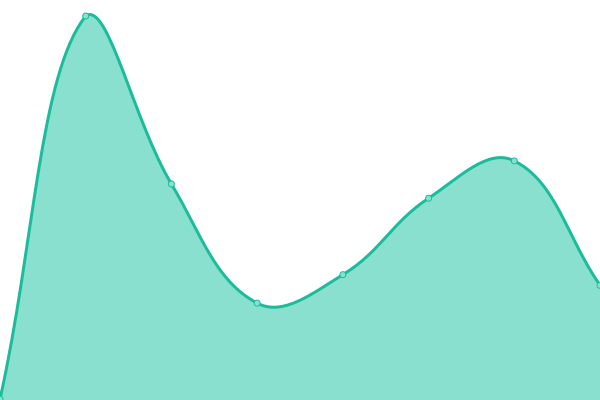

# [📈 Live Status](https://soham901.github.io/upptime): <!--live status--> **🟥 Complete outage**

This repository contains the open-source uptime monitor and status page for [Soham](https://soham901.me), powered by [Upptime](https://github.com/upptime/upptime).

With [Upptime](https://upptime.js.org), you can get your own unlimited and free uptime monitor and status page, powered entirely by a GitHub repository. We use [Issues](https://github.com/soham901/upptime/issues) as incident reports, [Actions](https://github.com/soham901/upptime/actions) as uptime monitors, and [Pages](https://soham901.github.io/upptime) for the status page.

<!--start: status pages-->
<!-- This summary is generated by Upptime (https://github.com/upptime/upptime) -->
<!-- Do not edit this manually, your changes will be overwritten -->
<!-- prettier-ignore -->
| URL | Status | History | Response Time | Uptime |
| --- | ------ | ------- | ------------- | ------ |
|  [DevLoop public site](https://devloop.soham901.me) | 🟥 Down | [dev-loop-public-site.yml](https://github.com/soham901/upptime/commits/HEAD/history/dev-loop-public-site.yml) | 

 0ms
     
 | 

<a href="https://soham901.github.io/upptime/history/dev-loop-public-site">0.00%</a>
    

|  [DevLoop LMS site](https://lms.soham901.me) | 🟥 Down | [dev-loop-lms-site.yml](https://github.com/soham901/upptime/commits/HEAD/history/dev-loop-lms-site.yml) | 

 0ms
     
 | 

<a href="https://soham901.github.io/upptime/history/dev-loop-lms-site">0.00%</a>
    

|  [Code Bhajia (mini leetcode clone)](https://codebhajia.soham901.me) | 🟥 Down | [code-bhajia-mini-leetcode-clone.yml](https://github.com/soham901/upptime/commits/HEAD/history/code-bhajia-mini-leetcode-clone.yml) | 

 0ms
     
 | 

<a href="https://soham901.github.io/upptime/history/code-bhajia-mini-leetcode-clone">0.00%</a>
    

<!--end: status pages-->

[**Visit our status website →**](https://soham901.github.io/upptime)

## 📄 License

- Powered by: [Upptime](https://github.com/upptime/upptime)
- Code: [MIT](./LICENSE) © [Anand Chowdhary](https://anandchowdhary.com), supported by [Pabio](https://pabio.com)
- Data in the `./history` directory: [Open Database License](https://opendatacommons.org/licenses/odbl/1-0/)
